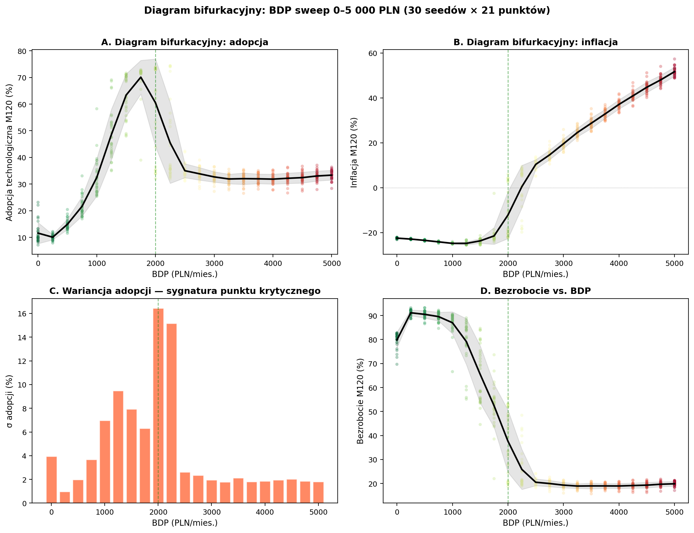
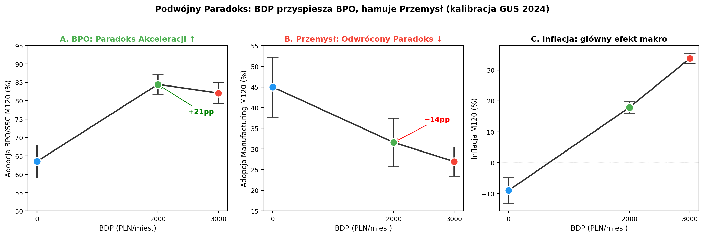
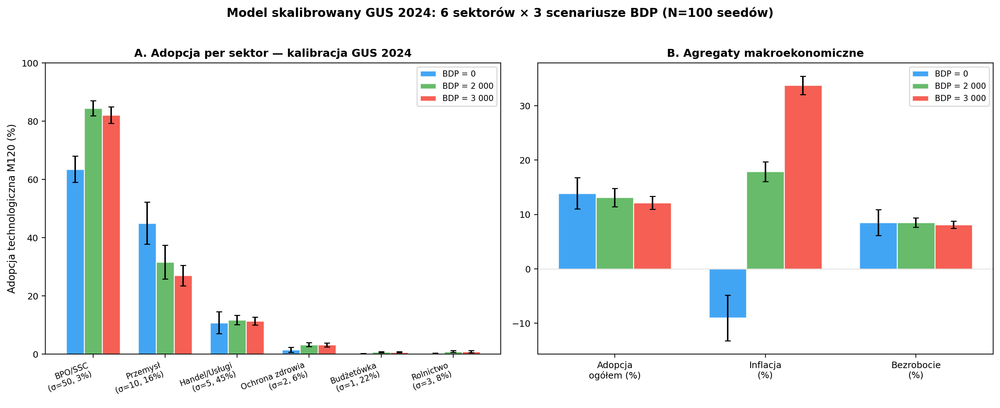

# SFC-ABM Model of Universal Basic Income and Technological Transformation

A Stock-Flow Consistent Agent-Based Model (SFC-ABM) investigating how Universal Basic Income (UBI) acts as a catalyst for technological transformation in a small open economy. The model discovers a **phase transition** at the optimal UBI level, where the economy bifurcates between high-adoption and low-adoption attractors.

## Key Findings

### Stylized model (4 sectors, equal shares)

| Scenario | Adoption | Inflation | Unemployment | Gini | Real Consumption |
|---|---|---|---|---|---|
| UBI = 0 | 12.9% ± 4.3% | -22.6% | 78.7% | 0.80 | 2,311 PLN |
| **UBI = 2,000** | **61.9% ± 16.4%** | -13.4% | 39.6% | **0.20** | **5,950 PLN** |
| UBI = 3,000 | 32.8% ± 2.1% | +19.4% | 19.4% | 0.10 | 1,570 PLN |

**Bimodality at UBI = 2,000 PLN**: Hartigan's dip test rejects unimodality with p = 1.7 × 10⁻⁵. GMM decomposition (K=3, selected by BIC) reveals three attractor states: ~59% of realizations converge to high adoption (μ = 73.2%), ~21% settle at low adoption (μ = 34.2%), and ~19% remain in an intermediate regime (μ = 57.6%). This is a signature of a **critical point** (phase transition) — the mean outcome (62%) does not correspond to any typical realization.



### GUS-calibrated model (6 sectors, Polish economy 2024)

| Scenario | Adoption | Inflation | Unemployment | BPO/SSC | Manufacturing |
|---|---|---|---|---|---|
| UBI = 0 | 13.9% ± 2.9% | −9.0% | 8.6% | 63.5% | 45.0% |
| **UBI = 2,000** | 13.1% ± 1.7% | **+17.9%** | 8.5% | **84.5%** | **31.6%** |
| UBI = 3,000 | 12.1% ± 1.2% | +33.8% | 8.1% | 82.1% | 27.0% |

**Dual Acceleration Paradox**: When calibrated to GUS/NBP 2024 data (6 sectors, sector-specific wage multipliers), UBI simultaneously *accelerates* automation in BPO/SSC (+21pp, σ=50) and *decelerates* it in Manufacturing (−13pp, σ=10) through the credit channel (Taylor rule → higher rates → capital-intensive sectors blocked). The 75% of the economy in low-σ sectors (retail, public, agriculture) is largely automation-resistant regardless of UBI level.




## Model Architecture

- **10,000 heterogeneous firm-agents** across 6 sectors (GUS 2024 calibration) with different CES elasticities of substitution (σ):
  - BPO/SSC (σ=50, 3%), Manufacturing (σ=10, 16%), Retail/Services (σ=5, 45%), Healthcare (σ=2, 6%), Public (σ=1, 22%), Agriculture (σ=3, 8%)
- **Sector-specific wage multipliers** reflecting GUS earnings data (BPO ×1.35, Agriculture ×0.67)
- **Watts-Strogatz small-world network** (k=6, rewiring p=0.10) with demonstration effects
- **6 macro sectors**: firms, households, government (MMT fiscal), banking (Basel III), central bank (Taylor rule), foreign sector (IRP exchange rate)
- **Stock-flow consistency**: all flows have counterpart stocks, government spending creates private assets
- **Soft deflation floor**: 30% pass-through beyond -1.5%/month, modeling downward price stickiness (Bewley 1999)

## Reproduction

### Requirements

- [Ammonite](https://ammonite.io/) 3.0.2+ (Scala 3)
- Python 3.10+ with: `numpy`, `pandas`, `matplotlib`, `scikit-learn`, `diptest`, `scipy`

### Run Monte Carlo — stylized model (3 scenarios × 100 seeds)

```bash
BDP=0    SEEDS=100 PREFIX=nobdp    amm simulation_mc.sc
BDP=2000 SEEDS=100 PREFIX=baseline amm simulation_mc.sc
BDP=3000 SEEDS=100 PREFIX=bdp3000  amm simulation_mc.sc
```

### Run Monte Carlo — GUS-calibrated model (3 scenarios × 100 seeds)

```bash
BDP=0    SEEDS=100 PREFIX=gus_nobdp    amm simulation_mc.sc
BDP=2000 SEEDS=100 PREFIX=gus_baseline amm simulation_mc.sc
BDP=3000 SEEDS=100 PREFIX=gus_bdp3k    amm simulation_mc.sc
```

Output: `mc/{prefix}_terminal.csv` (per-seed terminal values) and `mc/{prefix}_timeseries.csv` (monthly aggregates with mean/p05/p95).

### Run BDP parameter sweep (bifurcation diagram)

```bash
bash run_sweep.sh  # 21 points × 30 seeds = 630 simulations, ~10 min
```

### Generate figures

```bash
python analysis/mc_charts.py          # 6-panel time series, bimodal histogram, sectors, nonlinear
python analysis/mc_welfare.py         # Welfare analysis (Gini, real consumption)
python analysis/diptest_analysis.py   # Hartigan's dip test + GMM BIC
python analysis/sweep_analysis.py     # Bifurcation diagram
python analysis/gus_charts.py        # GUS-calibrated 6-sector comparison + dual paradox
```

## Figures

| Figure | Description |
|---|---|
| `v5_mc_panel6.png` | 6-panel time series with 90% CI bands (inflation, unemployment, adoption, FX, wages, debt) |
| `v5_mc_bimodal.png` | Bimodal adoption distribution, per-sector bars, phase space scatter |
| `v5_mc_bifurcation.png` | Bifurcation diagram: continuous BDP sweep 0–5,000 PLN (630 simulations) |
| `v5_mc_diptest.png` | Formal bimodality test: KDE + GMM fit, BIC model selection, cross-scenario comparison |
| `v5_mc_welfare.png` | Welfare analysis: real consumption, Gini, equality-consumption tradeoff |
| `v5_mc_nonlinear.png` | Non-monotonic (inverted-U) response of adoption and inflation to UBI level |
| `v5_mc_sectors.png` | Per-sector adoption time series (BPO fastest, Healthcare slowest) |
| `v6_gus_sector_comparison.png` | GUS-calibrated: 6-sector adoption bars + macro aggregates (3 UBI scenarios) |
| `v6_gus_dual_paradox.png` | Dual Paradox: BPO acceleration (+21pp) vs Manufacturing deceleration (−13pp) |

## Theoretical Framework

The model integrates three heterodox economics traditions:

1. **Modern Monetary Theory (MMT)**: Government as currency issuer faces no nominal budget constraint; UBI is financed via sovereign money creation (Kelton 2020, Mosler 1997)
2. **Non-ergodic economics**: Firms maximize survival probability, not expected profit; ruin barriers force irreversible automation decisions (Peters 2019)
3. **CES production functions**: Heterogeneous elasticity of substitution across sectors determines automation speed and labor displacement patterns (Acemoglu & Restrepo 2018)

The central thesis — the **Acceleration Paradox** — states that UBI, conventionally viewed as a response to technological unemployment, actually *causes* accelerated automation through cost-pressure and interest-rate channels.

## Citation

If you use this model or its results, please cite:

```
Maciaszek, M. (2026). Paradoks Akceleracji: Bezwarunkowy Dochód Podstawowy jako
katalizator transformacji technologicznej w ujęciu MMT, ekonomii nieergodycznej
i funkcji produkcji CES. MBA thesis, Mateusz Maciaszek.
```

## License

MIT License. See [LICENSE](LICENSE).
